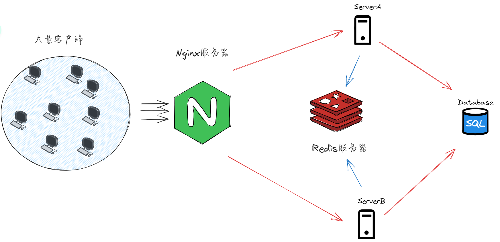

Nginx服务器利用负载均衡算法为客户端选择服务器

多个服务器共同访问同一台MySQL数据库服务器

如果用户之间进行跨服聊天的话，利用发布-订阅功能解决跨服通信问题

- （发布者）发起消息者向 接受消息者的频道中发送消息：PUBLISH channel message	
- （订阅者）接受消息者 在首次登录服务器之后会连接Redis服务器并 创建频道：SUBSCRIBE channel

MySQL服务器还会存储客户端的离线消息，等到上线之后就会主动读取并显示，然后就从数据库中删除离线消息

## 必要的环境

- 安装`boost`库
- 安装`Muduo`库
- 安装`Nginx`
- 安装`MySQL`
- 安装`Redis`

## 构建项目

### 创建数据库

sql文件在source文件夹下

```
#shell终端执行
mysql -u root -p your passward
#mysql终端执行
create database chat;
#shell终端执行
source chat.sql
```

### 编译项目以及执行

```
cmake -S . -B build

cmake --build build
```

进入到bin文件夹下，你将看到服务端和客户端两个可执行文件

```
# 启动服务端
./ChatServer 6000 

# 启动客户端
./ChatClient 127.0.0.1 8000
```

source文件夹下的PDF文件记录学习的过程，也许有些问题能够在里面得到解答

客户端连接到端口是nginx负载均衡器的端口，而服务器是在负载均衡器的背后，因此服务器开启的端口并不是客户端去直连的端口。因此，这还是要看你nginx配置的端口情况来定。上面给的服务端和客户端的启动方式是参考示例。如果你只是单纯的想要测试的话，即没有引入nginx，那就可以直连服务器端口测试了。

## 未来计划

- [ ] 数据库连接池
- [ ] Nginx性能优化
- [ ] 引入 conf 组件